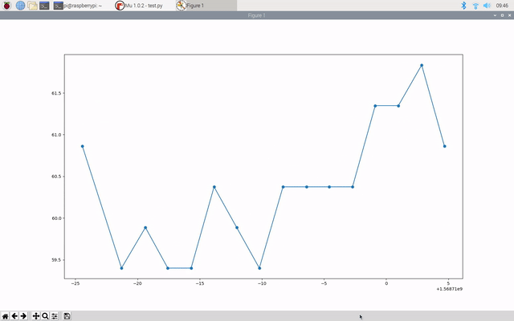
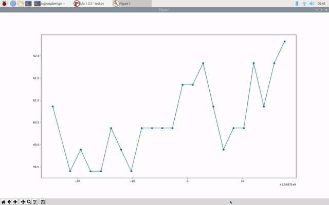

## What you will make

The system on a chip (SoC) of the Raspberry Pi has a temperature sensor that can be used to measure its temperature from the command line. This project's aim is to create a simple Python script that can run automatically as you boot up your Raspberry Pi, take measurements from the temperature sensor at given intervals, and write them into log files that can be viewed later. You'll also be able to view the data as an interactively plotted graph.

--- no-print ---

--- /no-print ---

--- print-only ---

--- /print-only ---

--- collapse ---
---
title: What you will need
---
### Hardware
+ A Raspberry Pi computer

### Software
+ matplotlib

To install the software you need, run the following command in the terminal:

```bash
sudo apt-get install python3-matplotlib
```
--- /collapse ---

--- collapse ---
---
title: What you will learn
---
By completing the Temperature project you will learn:

- How to write data to a file
- How to interactively plot data with matplotlib
- How to set scripts to run automatically using crontab

This resource covers elements from the following strands of the [Raspberry Pi Digital Making Curriculum](https://www.raspberrypi.org/curriculum/):
--- /collapse ---

--- collapse ---
---
title: Additional information for educators
---
If you need to print this project, please use the [printer-friendly version](https://projects.raspberrypi.org/en/projects/temperature-log/print){:target="_blank"}.

You can find the [completed project here](https://rpf.io/p/en/temperature-log-get){:target="_blank"}.
--- /collapse ---


